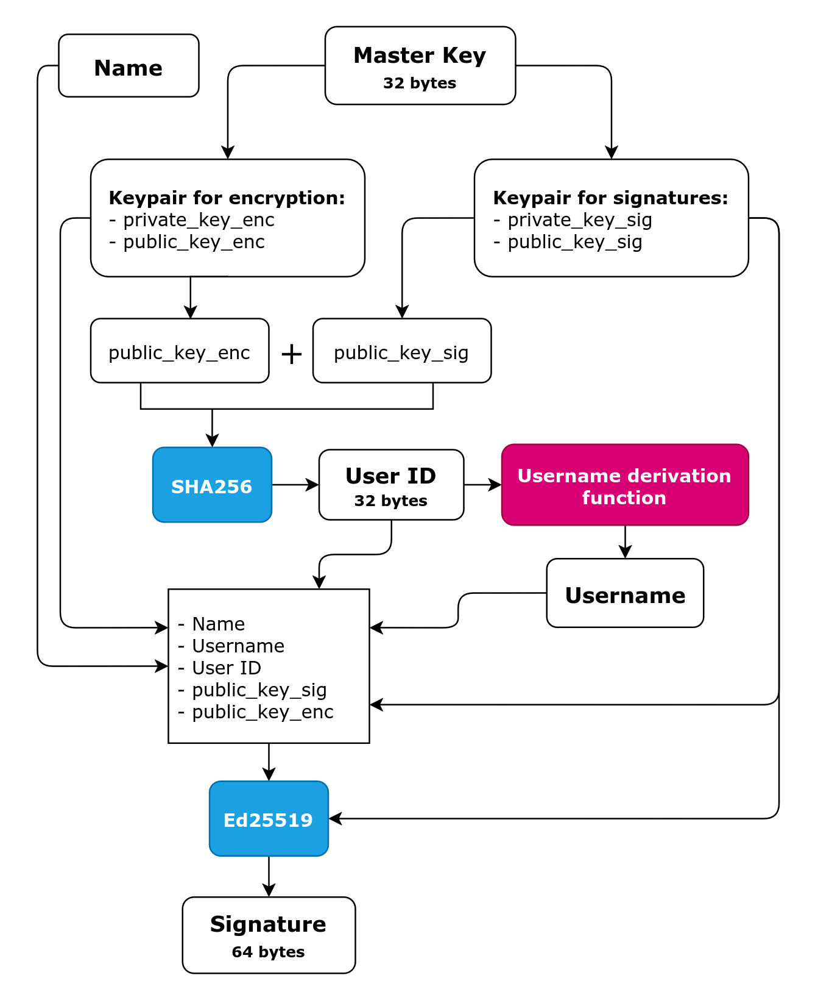

# RFC 0001: Account Creation
Status: `Implemented`

Author: Danylo Derkach

Created: 2026-01-01

Last Update: 2026-01-12
## 1. Summary
This RFC proposes an account creation model based on a cryptographic identity. All account cryptographic material is deterministically derived from a single Master Key. The design intentionally avoids passwords, emails, and other server-managed credentials.
## 2. Definitions

| Definition   | Meaning                                                                                                |
| ------------ | ------------------------------------------------------------------------------------------------------ |
| `Account`    | Logical identity of a user                                                                             |
| `Master Key` | A high-entropy secret from which all cryptographic material of an account is deterministically derived |
| `Username`   | A public, deterministic identifier derived from cryptographic material and used for peer discovery     |
| `User ID`    | A permanent identifier derived from public cryptographic material                                      |
| `Name`       | A public name of a user                                                                                |

## 3. Motivation
Account creation defines zero-trust assumptions, cryptographic root material, and long-term compatibility of identities. Design flaws at this stage are difficult or impossible to fix without breaking existing accounts.
## 4. Goals & Non-Goals
**Goals**
- Deterministic account creation flow
- Ensure trust through cryptography
- Ability to import account using a Master Key
- Long-term compatibility

**Non-Goals**
- Account recovery mechanism
- Authentication protocol
## 5. Requirements
- Account **MUST** be based on cryptographic identity
- Account **MUST NOT** include emails, phone numbers or any other user's data
- Account authentication **MUST NOT** be password-based
- Account cryptographic identity **MUST** be derived from a Master Key
- It **MUST** be possible to verify authenticity of account cryptographic identity
- Account name **MUST** be at least 1 byte length
- Account name **MUST NOT** be longer than 64 bytes
## 6. Proposed Design

**Account Public Components:**
- **Name**. A public name of a user.
- **Username**. A public, deterministic identifier derived from public cryptographic material.
- **User ID**. A permanent identifier, derived from public cryptographic material.
- **Public Key Ed25519**. A public key, used for verification cryptographic signatures.
- **Public Key X25519**. A public key, used for asymmetric encryption.
- **Signature**. A cryptographic signature, used for verification authenticity of an identity.

**Account Private Components:**
- **Master Key**. A high-entropy secret. Used to derive all account cryptographic material.
- **Private Key Ed25519**. A private key, used for making cryptographic signatures.
- **Private Key X25519**. A private key, used for asymmetric encryption.

Account private components never leave a device.
### Account Creation Scheme

This design allows to derive whole account cryptographic identity from the Master Key. The account identity is cryptographically signed using a key derived from the Master Key, allowing independent verification of authenticity.

There is no account recovery by design. Loss of the Master Key implies loss of the account.

## 7. Module Responsibilities

- core/
  - validates name
  - owns business rules
  - finalizes account creation
- crypto/
  - cryptographic identity derivation
  - does not perform business logic
  - provides hash implementation
- shared/
  - error handling

## 8. Security Considerations

Account creation is a strictly local operation. If server is compromised, confidentiality of private keys and encrypted messages is preserved, because private keys are part of account cryptographic identity, derived from the Master Key. Private keys never leave a device, which makes impossible to access private messages even in case of compromised server. 

The security of a user account depends only on the user. Loss of the Master Key implies loss of the account.

Which attacks ARE mitigated:
- Server database leaks
- Server-side MITM via key substitution

Which attacks ARE NOT mitigated:
- Master Key stealing
- Targeted device attacks
- Social engineering
## 9. Alternatives Considered

*Alternative 1.* Account is a database record, standard login/password authentication model. Account does not have cryptographic identity, server owns all data. Rejected because:
- Does not ensure trust through cryptography
- Not mitigated server-side MITM attacks via key substitution
- Server owns all data
## 10. Impact on Existing Architecture
This RFC introduces the following dependencies:
- `core` -> `crypto`
- `core` -> `shared`
- `crypto` -> `shared`
- `crypto` -> libsodium

## 11. References
- [RFC 0002 Username Derivation Scheme](RFC-0002-username-derivation-scheme)
- [libsodium documentation](https://doc.libsodium.org/doc/quickstart)