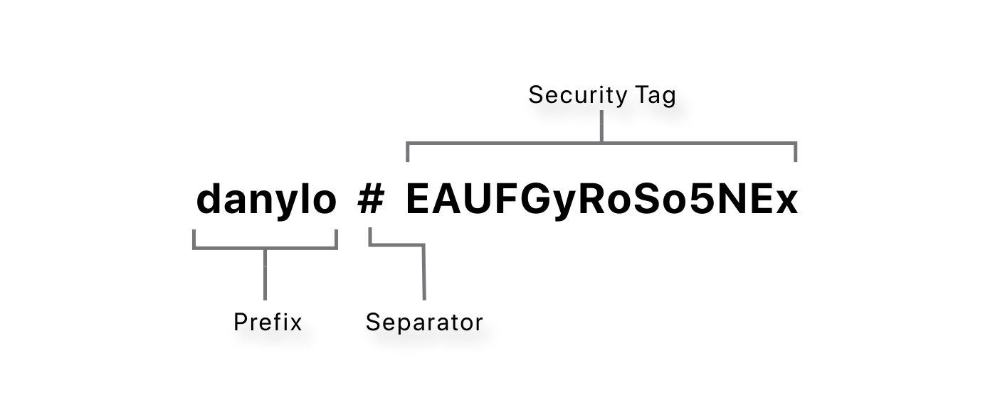
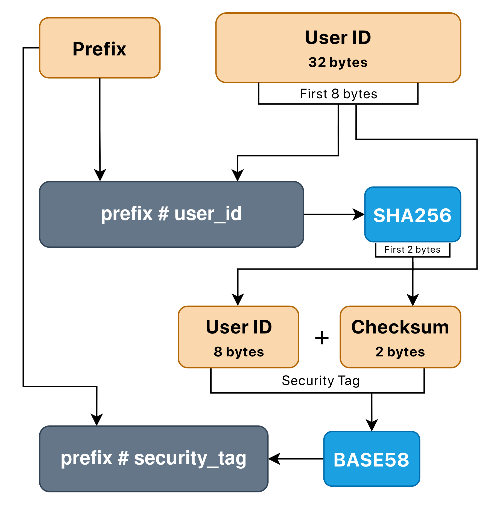

# RFC 0002: Username Derivation Scheme
Status: `Implemented`
Author: Danylo Derkach
Created: 2026-01-06
Last Update: 2026-01-06
## 1. Summary
Proposes a deterministic username derivation scheme.
The scheme allows users to independently verify the authenticity and integrity
of an identity without trusting the server.
This aligns with the project’s zero-trust philosophy, where trust is established
exclusively through cryptography.

## 2. Definitions

| Definition     | Meaning                                                                                            |
| -------------- | -------------------------------------------------------------------------------------------------- |
| `Username`     | A public, deterministic identifier derived from cryptographic material and used for peer discovery |
| `Prefix`       | The human-readable part of the username, chosen by the user                                        |
| `Separator`    | The `#` symbol, which separates prefix from security tag                                           |
| `Security Tag` | The cryptographic material which ensures identity authenticity                                     |

## 3. Motivation
This RFC is necessary because:
- Users need a human-readable identifier that does not rely on server trust
- Users must be able to verify end-to-end encryption before initiating a chat
- The system must prevent silent MITM attacks performed by a compromised server

## 4. Goals & Non-Goals
**Goals:**
- Deterministic username derivation
- Ability to verify the authenticity of identity
- Ability to instantly verify the integrity of username
- Ensure trust through cryptography
- User lookup model, balanced between security and convenience

**Non-Goals:**
- Account recovery mechanism
- Convenience over security
## 5. Requirements
- Username **MUST** provide ability to verify authenticity of an identity
- Username **MUST** provide ability to instantly verify its integrity
- Prefix **MUST** contains only permitted symbols: `A-z`, `0-9`, `_`, `.`, `-`
- Prefix **MUST** be at least 1 symbol length
- Prefix **MUST NOT** be longer than 16 symbols
- Security tag binary length **MUST** be 10 bytes
- Security tag **MUST** be encoded as base58 string
- Security tag **MUST** be derived from identity public cryptographic material
- Security tag **MUST NOT** contain private cryptographic material
## 6. Proposed Design
### Username Scheme

- **Prefix**. The human-readable part of the username, user can change it at any time.
- **Separator**. The `#` symbol which separates prefix from security tag.
- **Security Tag**. The base58 encoded 10 bytes length array. First 8 bytes - part of a public cryptographic material, last 2 bytes - a checksum, used to detect accidental input errors.
### Username Derivation Flow

This design enables independent verification of identity authenticity by
binding the username to cryptographic identity material.

The security tag is deterministically derived from the identity public keys,
making it computationally infeasible to forge a valid username for a different
identity.

The checksum is included only to detect accidental input errors. A valid
checksum does not imply authenticity, as security guarantees are provided
exclusively by cryptographic verification.
## 7. Module Responsibilities

- core/
  - validates prefix
  - owns business rules
  - orchestrates cryptographic operations
  - assembles final username
- crypto/
  - provides hash implementation
- shared/
  - provides base58 encoding library
  - result handling
## 8. Security Considerations

Username derivation is a strictly local operation. If the server is compromised and public keys are replaced (MITM attack), forged identity won't pass authenticity verification. The username contains cryptographic material derived from public keys, and the whole identity is signed by master key, which allows to instantly notice a forged identity.

Which attacks ARE mitigated:
- Keys replacement by the server (MITM)
- MITM during key exchange
- Forged messages

Which attacks ARE NOT mitigated:
- Targeted device attacks
- Master Key stealing
- Social engineering
## 9. Alternatives Considered

*Alternative 1*. The username is fully based on cryptographic material, which is one of safest schemes. Rejected because:
- The username will be large (about 44 characters)
- Not human-readable
- Inconvenient

*Alternative 2*. The username is chosen arbitrarily like `@john089`. Rejected because:
- Does not ensure trust through cryptography
- Convenience over security
## 10. Impact on Existing Architecture

This RFC does not change module boundaries, introduce new dependencies or break compatibility.
## 11. Open Questions

- Allowed characters in prefix
- Prefix minimal length

## 12. References

Related RFCs:
- [RFC-0001-account-creation.md](RFC-0001-account-creation.md)